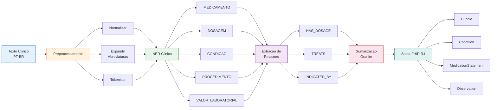
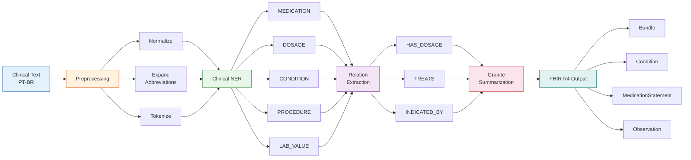

# Watsonx Clinical NLP PT-BR

[](https://www.python.org/)
[](https://www.ibm.com/watsonx)
[](https://spacy.io/)
[](https://www.hl7.org/fhir/)
[](https://fastapi.tiangolo.com/)
[](https://streamlit.io/)
[](LICENSE)
[](https://github.com/galafis/watsonx-clinical-nlp-ptbr/actions/workflows/ci.yml)

---

**[Portugues](#portugues) | [English](#english)**

---

<a name="portugues"></a>
## Portugues

### Visao Geral

Pipeline de Processamento de Linguagem Natural (NLP) clinico para textos medicos em **Portugues Brasileiro**, utilizando **IBM Watsonx AI** e modelos **Granite**. O sistema extrai entidades clinicas, identifica relacoes entre medicamentos e condicoes, gera resumos estruturados e produz saida em formato **FHIR R4** para interoperabilidade com sistemas de saude.

### Funcionalidades

| Funcionalidade | Descricao |
|---|---|
| **Preprocessamento PT-BR** | Normalizacao de texto clinico, expansao de 200+ abreviaturas medicas, tokenizacao especializada |
| **NER Clinico** | Extracao de entidades: medicamentos, dosagens, condicoes, procedimentos, valores laboratoriais |
| **Extracao de Relacoes** | Identificacao de relacoes medicamento-dosagem, medicamento-condicao, procedimento-condicao |
| **Sumarizacao com Granite** | Resumos clinicos estruturados usando IBM Watsonx Granite 13B |
| **Saida FHIR R4** | Conversao automatica para Bundle, Condition, MedicationStatement, Procedure, Observation |
| **Conformidade LGPD** | Deteccao e mascaramento de dados pessoais sensiveis (CPF, nomes, enderecos) |
| **API REST** | Endpoints FastAPI para integracao com sistemas hospitalares |
| **Interface Streamlit** | Dashboard interativo para visualizacao de entidades e relacoes |

### Arquitetura



### Tipos de Entidades

| Tipo | Descricao | Exemplo | Cor |
|---|---|---|---|
| `MEDICAMENTO` | Medicamentos, farmacos, principios ativos | Losartana, Metformina, Omeprazol | :green_circle: `#4CAF50` |
| `DOSAGEM` | Dosagens, frequencias, vias de administracao | 50mg, 2x/dia, via oral | :blue_circle: `#2196F3` |
| `CONDICAO` | Condicoes clinicas, doencas, sintomas | Hipertensao, Diabetes, Pneumonia | :red_circle: `#F44336` |
| `PROCEDIMENTO` | Procedimentos, cirurgias, exames | Tomografia, Hemograma, Endoscopia | :orange_circle: `#FF9800` |
| `VALOR_LABORATORIAL` | Resultados de exames com valores numericos | Hemoglobina: 12,5 g/dL, Creatinina 1,2 mg/dL | :purple_circle: `#9C27B0` |

### Stack Tecnologico

| Camada | Tecnologias |
|---|---|
| **LLM / IA** | IBM Watsonx AI, Granite 13B Chat v2, LangChain |
| **NLP** | spaCy (pt_core_news_sm), regex patterns, gazetteers |
| **Backend** | Python 3.10+, FastAPI, Pydantic, structlog |
| **Frontend** | Streamlit |
| **Healthcare** | FHIR R4, HL7, LOINC |
| **Infra** | Docker, Docker Compose, GitHub Actions CI |
| **Qualidade** | pytest, ruff, mypy, pre-commit |

### Inicio Rapido

#### Pre-requisitos

- Python 3.10+
- Conta IBM Cloud com acesso ao Watsonx AI
- Docker (opcional)

#### Instalacao Local

```bash
# Clonar o repositorio
git clone https://github.com/galafis/watsonx-clinical-nlp-ptbr.git
cd watsonx-clinical-nlp-ptbr

# Criar ambiente virtual
python -m venv .venv
source .venv/bin/activate  # Linux/Mac
# .venv\Scripts\activate   # Windows

# Instalar dependencias
make install
# ou: pip install -r requirements.txt && python -m spacy download pt_core_news_sm

# Configurar variaveis de ambiente
cp .env.example .env
# Editar .env com suas credenciais IBM Watsonx

# Executar testes
make test

# Iniciar API
make run-api

# Iniciar interface Streamlit
make run-ui
```

#### Com Docker

```bash
# Configurar variaveis de ambiente
cp .env.example .env
# Editar .env com suas credenciais

# Construir e iniciar servicos
docker-compose up -d

# API disponivel em http://localhost:8080
# UI disponivel em http://localhost:8501
```

### Estrutura do Projeto

```
watsonx-clinical-nlp-ptbr/
├── src/
│   ├── __init__.py
│   ├── config.py                          # Configuracao (env + YAML)
│   ├── preprocessing/
│   │   ├── __init__.py
│   │   ├── normalizer.py                  # Normalizacao de texto clinico
│   │   ├── abbreviation_expander.py       # 200+ abreviaturas medicas PT-BR
│   │   └── tokenizer.py                   # Tokenizacao clinica
│   ├── ner/
│   │   ├── __init__.py
│   │   ├── clinical_ner.py                # Motor NER (regex + gazetteers)
│   │   ├── entity_types.py                # Taxonomia de entidades
│   │   └── relation_extractor.py          # Extracao de relacoes
│   └── summarization/
│       ├── __init__.py
│       ├── clinical_summarizer.py         # Sumarizacao com Granite
│       └── fhir_formatter.py              # Formatacao FHIR R4
├── tests/
│   ├── __init__.py
│   ├── test_preprocessing.py
│   ├── test_ner.py
│   ├── test_relations.py
│   └── test_summarization.py
├── notebooks/
│   └── 01_clinical_nlp_demo.ipynb         # Demo interativo
├── docs/
│   └── architecture.md                    # Documentacao de arquitetura
├── config/
│   └── settings.yaml                      # Configuracoes do pipeline
├── .github/
│   └── workflows/
│       └── ci.yml                         # GitHub Actions CI
├── Dockerfile
├── docker-compose.yml
├── Makefile
├── pyproject.toml
├── requirements.txt
├── requirements-dev.txt
├── .env.example
├── .gitignore
├── LICENSE
└── README.md
```

### Endpoints da API

| Metodo | Endpoint | Descricao |
|---|---|---|
| `GET` | `/health` | Health check do servico |
| `POST` | `/api/v1/process` | Processar texto clinico completo (NER + relacoes + resumo) |
| `POST` | `/api/v1/ner` | Extrair apenas entidades clinicas |
| `POST` | `/api/v1/relations` | Extrair relacoes entre entidades |
| `POST` | `/api/v1/summarize` | Gerar resumo clinico estruturado |
| `POST` | `/api/v1/fhir/bundle` | Converter entidades para FHIR Bundle |
| `POST` | `/api/v1/fhir/composition` | Gerar FHIR Composition a partir de resumo |

### Exemplo de Uso

```python
from src.preprocessing import ClinicalTextNormalizer, AbbreviationExpander, ClinicalTokenizer
from src.ner import ClinicalNER, RelationExtractor
from src.summarization import ClinicalSummarizer, FHIRFormatter

# Texto clinico de exemplo
texto = "Paciente com HAS em uso de Losartana 50mg 1x/dia. DM2 controlada com Metformina 850mg 2x/dia. Hemoglobina: 12,5 g/dL."

# Preprocessamento
normalizer = ClinicalTextNormalizer()
expander = AbbreviationExpander()
texto_normalizado = normalizer.normalize(texto)
texto_expandido = expander.expand(texto_normalizado)

# Extracao de entidades
ner = ClinicalNER()
entities = ner.extract(texto_expandido)

# Extracao de relacoes
relation_extractor = RelationExtractor()
relations = relation_extractor.extract(entities, texto_expandido)

# Sumarizacao
summarizer = ClinicalSummarizer()
summary = summarizer.summarize_from_entities(entities, relations, texto_expandido)

# Saida FHIR R4
fhir = FHIRFormatter()
bundle = fhir.entities_to_bundle(entities)
```

---

<a name="english"></a>
## English

### Overview

Clinical Natural Language Processing (NLP) pipeline for **Brazilian Portuguese** medical texts, powered by **IBM Watsonx AI** and **Granite** models. The system extracts clinical entities, identifies relationships between medications and conditions, generates structured summaries, and produces **FHIR R4** output for healthcare system interoperability.

### Features

| Feature | Description |
|---|---|
| **PT-BR Preprocessing** | Clinical text normalization, 200+ medical abbreviation expansion, specialized tokenization |
| **Clinical NER** | Entity extraction: medications, dosages, conditions, procedures, lab values |
| **Relation Extraction** | Identification of medication-dosage, medication-condition, procedure-condition relations |
| **Granite Summarization** | Structured clinical summaries using IBM Watsonx Granite 13B |
| **FHIR R4 Output** | Automatic conversion to Bundle, Condition, MedicationStatement, Procedure, Observation |
| **LGPD Compliance** | Detection and masking of sensitive personal data (CPF, names, addresses) |
| **REST API** | FastAPI endpoints for integration with hospital systems |
| **Streamlit UI** | Interactive dashboard for entity and relation visualization |

### Architecture



### Entity Types

| Type | Description | Example | Color |
|---|---|---|---|
| `MEDICAMENTO` | Medications, drugs, active ingredients | Losartana, Metformina, Omeprazol | :green_circle: `#4CAF50` |
| `DOSAGEM` | Dosages, frequencies, routes of administration | 50mg, 2x/dia, via oral | :blue_circle: `#2196F3` |
| `CONDICAO` | Clinical conditions, diseases, symptoms | Hipertensao, Diabetes, Pneumonia | :red_circle: `#F44336` |
| `PROCEDIMENTO` | Procedures, surgeries, exams | Tomografia, Hemograma, Endoscopia | :orange_circle: `#FF9800` |
| `VALOR_LABORATORIAL` | Lab results with numeric values | Hemoglobina: 12.5 g/dL, Creatinina 1.2 mg/dL | :purple_circle: `#9C27B0` |

### Tech Stack

| Layer | Technologies |
|---|---|
| **LLM / AI** | IBM Watsonx AI, Granite 13B Chat v2, LangChain |
| **NLP** | spaCy (pt_core_news_sm), regex patterns, gazetteers |
| **Backend** | Python 3.10+, FastAPI, Pydantic, structlog |
| **Frontend** | Streamlit |
| **Healthcare** | FHIR R4, HL7, LOINC |
| **Infra** | Docker, Docker Compose, GitHub Actions CI |
| **Quality** | pytest, ruff, mypy, pre-commit |

### Quick Start

#### Prerequisites

- Python 3.10+
- IBM Cloud account with Watsonx AI access
- Docker (optional)

#### Local Installation

```bash
# Clone the repository
git clone https://github.com/galafis/watsonx-clinical-nlp-ptbr.git
cd watsonx-clinical-nlp-ptbr

# Create virtual environment
python -m venv .venv
source .venv/bin/activate  # Linux/Mac
# .venv\Scripts\activate   # Windows

# Install dependencies
make install
# or: pip install -r requirements.txt && python -m spacy download pt_core_news_sm

# Set up environment variables
cp .env.example .env
# Edit .env with your IBM Watsonx credentials

# Run tests
make test

# Start API
make run-api

# Start Streamlit UI
make run-ui
```

#### With Docker

```bash
# Set up environment variables
cp .env.example .env
# Edit .env with your credentials

# Build and start services
docker-compose up -d

# API available at http://localhost:8080
# UI available at http://localhost:8501
```

### API Endpoints

| Method | Endpoint | Description |
|---|---|---|
| `GET` | `/health` | Service health check |
| `POST` | `/api/v1/process` | Full clinical text processing (NER + relations + summary) |
| `POST` | `/api/v1/ner` | Extract clinical entities only |
| `POST` | `/api/v1/relations` | Extract entity relations |
| `POST` | `/api/v1/summarize` | Generate structured clinical summary |
| `POST` | `/api/v1/fhir/bundle` | Convert entities to FHIR Bundle |
| `POST` | `/api/v1/fhir/composition` | Generate FHIR Composition from summary |

### Usage Example

```python
from src.preprocessing import ClinicalTextNormalizer, AbbreviationExpander, ClinicalTokenizer
from src.ner import ClinicalNER, RelationExtractor
from src.summarization import ClinicalSummarizer, FHIRFormatter

# Sample clinical text
text = "Paciente com HAS em uso de Losartana 50mg 1x/dia. DM2 controlada com Metformina 850mg 2x/dia. Hemoglobina: 12,5 g/dL."

# Preprocessing
normalizer = ClinicalTextNormalizer()
expander = AbbreviationExpander()
normalized = normalizer.normalize(text)
expanded = expander.expand(normalized)

# Entity extraction
ner = ClinicalNER()
entities = ner.extract(expanded)

# Relation extraction
relation_extractor = RelationExtractor()
relations = relation_extractor.extract(entities, expanded)

# Summarization
summarizer = ClinicalSummarizer()
summary = summarizer.summarize_from_entities(entities, relations, expanded)

# FHIR R4 output
fhir = FHIRFormatter()
bundle = fhir.entities_to_bundle(entities)
```

---

## Autor / Author

**Gabriel Demetrios Lafis**

- GitHub: [galafis](https://github.com/galafis)
- LinkedIn: [gabriel-demetrios-lafis](https://www.linkedin.com/in/gabriel-demetrios-lafis/)

## Licenca / License

This project is licensed under the MIT License - see the [LICENSE](LICENSE) file for details.
