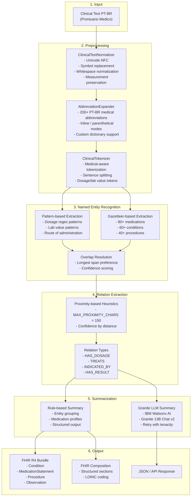
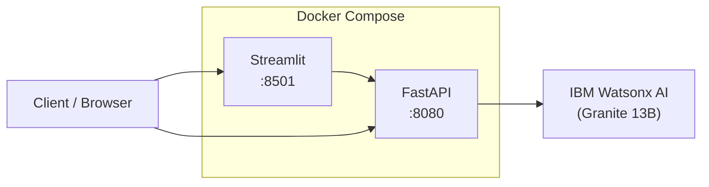

# Architecture / Arquitetura

## Overview / Visao Geral

The **watsonx-clinical-nlp-ptbr** project implements a multi-stage pipeline for processing clinical texts written in Brazilian Portuguese. Each stage is modular, testable, and designed for healthcare interoperability via FHIR R4.

O projeto **watsonx-clinical-nlp-ptbr** implementa um pipeline multi-etapas para processamento de textos clinicos escritos em Portugues Brasileiro. Cada etapa e modular, testavel e projetada para interoperabilidade em saude via FHIR R4.

---

## Pipeline Architecture / Arquitetura do Pipeline

---

## Module Details / Detalhes dos Modulos

### 2.1 ClinicalTextNormalizer (`src/preprocessing/normalizer.py`)

Normalizes raw clinical text for downstream processing:

- **Unicode normalization**: NFC form for consistent character representation
- **Symbol replacement**: Converts typographic characters (en-dash, em-dash, smart quotes, bullet points, degree symbol) to standard ASCII equivalents
- **Measurement preservation**: Protects dosage patterns (e.g., `50mg`), lab values (e.g., `3,5 mg/dL`), dates (`DD/MM/YYYY`), and times (`HH:MM`) from being altered during normalization
- **Control character removal**: Strips non-printable characters while preserving newlines and tabs
- **Whitespace normalization**: Collapses multiple spaces/tabs and limits consecutive newlines
- **Optional accent removal**: Configurable for use cases where accent-free text is required

### 2.2 AbbreviationExpander (`src/preprocessing/abbreviation_expander.py`)

Expands medical abbreviations with 200+ built-in entries covering:

| Category | Examples |
|---|---|
| Cardiovascular | HAS, IAM, ICC, FA, DAC, AVC, TVP, TEP |
| Endocrine | DM, DM1, DM2, HbA1c, TSH, IMC |
| Respiratory | DPOC, SDRA, IOT, VM, VNI, SpO2 |
| Gastrointestinal | DRGE, DII, EDA, TGO, TGP |
| Renal | IRC, IRA, DRC, TFG, HD, ITU |
| Neurological | TCE, HIC, TC, RNM, EEG, SNC |
| Hematological | HB, HT, VCM, PLT, INR, PCR, VHS |
| Medications | AAS, IECA, BRA, BCC, BB, AINE, IBP |
| Routes/Forms | EV, VO, IM, SC, SL, CP, AMP |
| Clinical General | QP, HDA, HPP, EF, UTI, PS, BEG, LOTE |
| Laboratory | HMG, Na, K, Ca, Cr, Ur, AG, CPK |
| Procedures | PO, RX, USG, ECO, BX, QT, RT |

Features:
- **Inline mode**: Replaces abbreviation with full expansion
- **Parenthetical mode**: Appends expansion after abbreviation
- **External dictionary**: Loads additional abbreviations from JSON file
- **Case-insensitive matching**: Handles mixed-case clinical text

### 2.3 ClinicalTokenizer (`src/preprocessing/tokenizer.py`)

Medical-aware tokenizer producing `ClinicalToken` and `ClinicalSentence` objects:

- Token types: `word`, `number`, `measurement`, `punctuation`
- Preserves dosage patterns as single tokens (e.g., `50mg`, `120x80 mmHg`)
- Handles Brazilian decimal notation with comma (`12,5`)
- Clinical-aware sentence boundary detection (handles abbreviations and structured notes)

### 3. ClinicalNER (`src/ner/clinical_ner.py`)

Multi-strategy NER engine:

1. **Pattern-based**: Regex patterns for dosages (amount+unit, frequency, interval, route) and lab values (name+value+unit)
2. **Gazetteer-based**: Dictionary lookup for medications (80+ entries), conditions (60+), and procedures (40+)
3. **Overlap resolution**: Prefers longer spans and higher confidence when entities overlap
4. **Confidence filtering**: Configurable threshold (default: 0.65)

Entity types defined in `src/ner/entity_types.py`:

| EntityType | FHIR Resource | Color |
|---|---|---|
| MEDICAMENTO | MedicationStatement | #4CAF50 |
| DOSAGEM | (part of MedicationStatement) | #2196F3 |
| CONDICAO | Condition | #F44336 |
| PROCEDIMENTO | Procedure | #FF9800 |
| VALOR_LABORATORIAL | Observation | #9C27B0 |

### 4. RelationExtractor (`src/ner/relation_extractor.py`)

Proximity-based relation extraction:

- **MAX_PROXIMITY_CHARS**: 150 characters maximum distance between related entities
- **Confidence calculation**: Inversely proportional to character distance, with bonus for HAS_DOSAGE pairs
- **Evidence extraction**: Captures the text span between entity pairs with 20-char context window
- **Medication profiling**: Aggregates medications with their dosages and conditions

Supported relation types:

| Relation | Source Type | Target Type |
|---|---|---|
| HAS_DOSAGE | MEDICAMENTO | DOSAGEM |
| TREATS | MEDICAMENTO | CONDICAO |
| INDICATED_BY | PROCEDIMENTO | CONDICAO |
| HAS_RESULT | VALOR_LABORATORIAL | CONDICAO |

### 5. ClinicalSummarizer (`src/summarization/clinical_summarizer.py`)

Two summarization modes:

1. **Rule-based** (`summarize_from_entities`): Groups entities by type, builds medication profiles, produces structured JSON output. No external API calls required.

2. **Granite LLM** (`summarize_with_granite`): Sends extracted entities and optional original text to IBM Watsonx Granite 13B Chat v2 with a Portuguese system prompt. Uses `tenacity` for retry logic (3 attempts, exponential backoff).

### 6. FHIRFormatter (`src/summarization/fhir_formatter.py`)

Converts NLP output to FHIR R4-compliant JSON:

- **`entities_to_bundle`**: Creates a FHIR Transaction Bundle with individual resources per entity
- **`summary_to_composition`**: Creates a FHIR Composition with structured sections (Conditions, Medications, Procedures, Lab Results)

All resources include:
- Unique UUIDs
- Patient references
- Timestamps
- NLP confidence notes

---

## Configuration / Configuracao

Configuration is layered:

1. **Environment variables** (`.env`): Watsonx credentials, app settings
2. **YAML config** (`config/settings.yaml`): NER parameters, preprocessing options, summarization prompts, governance rules, FHIR settings
3. **Pydantic models** (`src/config.py`): Type-safe settings with validation

---

## Deployment / Implantacao

- **API container**: FastAPI + Uvicorn on port 8080
- **UI container**: Streamlit on port 8501, depends on API health check
- **Watsonx AI**: External IBM Cloud service called for LLM summarization

---

## Governance & Compliance

- **LGPD compliance**: PHI detection and masking (CPF, full names, dates of birth, addresses, phone numbers, emails, RG)
- **Audit logging**: All prompts and responses logged via structlog
- **Drift monitoring**: Configurable precision/recall thresholds with alerting
- **Data retention**: 90-day default retention policy

---

## Author / Autor

**Gabriel Demetrios Lafis**
- GitHub: [galafis](https://github.com/galafis)
- LinkedIn: [gabriel-demetrios-lafis](https://www.linkedin.com/in/gabriel-demetrios-lafis/)
